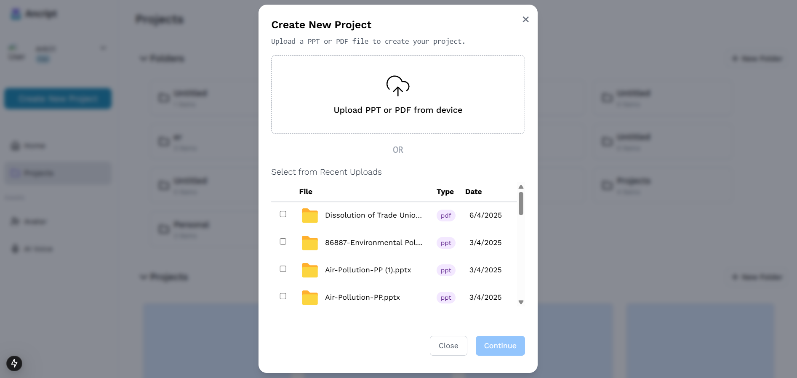
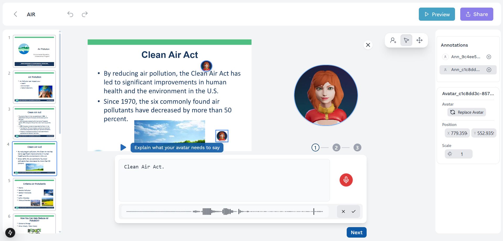
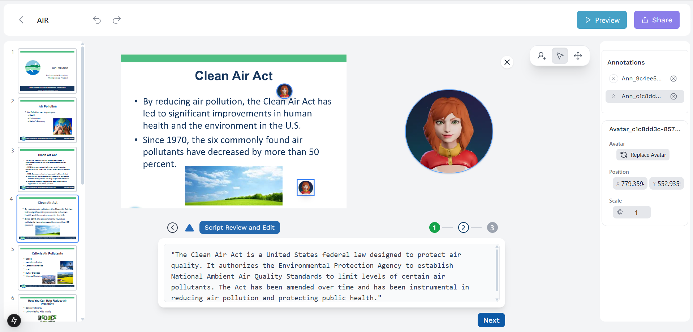

# 🎥 Ancript

**Turn Boring Slides into Interactive, Avatar-Guided Lessons!**  
Make your presentations come alive with expressive AI avatars that explain your content — no video editing required!

---

## 🚀 Features

- **Upload Presentations** (PPT or PDF)
- **Record Your Thoughts Casually** – No need for perfection
- **AI-Generated Polished Script** – Your words turned into professional narration
- **Animated AI Avatars** – 3D avatars speak and guide through your slides
- **Background Scene Generation** – Auto-generated relevant backgrounds
- **Effortless Sharing** – Share your interactive presentation with a simple link
- **Multilingual Support** – Auto-translate into 20+ languages
- **No Video Editing Needed** – Save 10+ hours per month!

---

## 🛠 How It Works

1. **Upload Your Slides** – Import your PowerPoint or PDF.
2. **Record Your Thoughts** – Speak casually; no scripting needed.
3. **AI Enhances Everything** – Auto-generate polished scripts and avatars.
4. **Pin Avatars Anywhere** – Guide your audience through your slides interactively.
5. **Share Easily** – One link to access everything, anywhere.

---

## 📸 Screenshots

### 1. Upload Your Presentation

### 2. Record Your Thoughts Casually

### 3. AI Generates Polished Scripts and Avatars

---

## ✨ Why Ancript?

- **Boost Course Completion Rates** – Make learning engaging and easy.
- **Save Time** – No need for manual scripting, recording, or editing.
- **Create Studio-Quality Content** – Without needing a studio.
- **Works Anywhere** – Embed avatars in Teachable, Thinkific, or any LMS.

---

## 📢 Join the Future of Learning

Transform your boring slides into dynamic, interactive learning experiences — all powered by AI avatars! 🚀

---

## 📄 License

This project is licensed under the MIT License.

---

<b>Made with ❤️ for creators and educators.</b>

